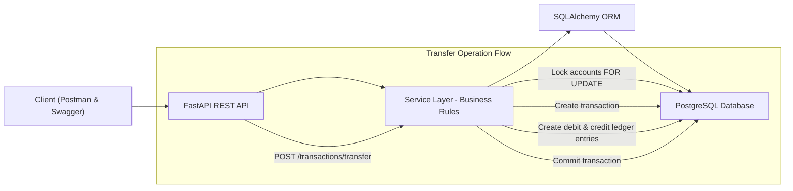
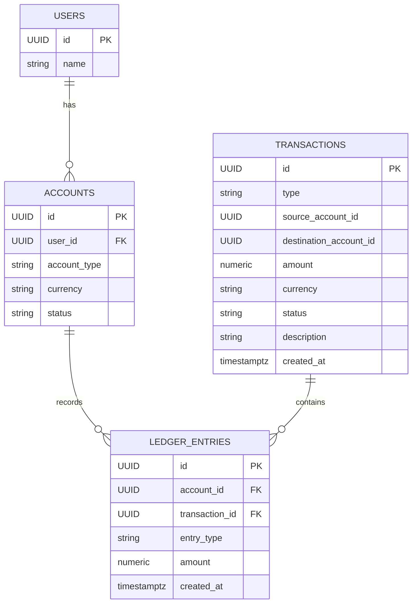

# 🌐 Financial Ledger API

A fully ACID-compliant double-entry bookkeeping financial ledger system built using **FastAPI**, **PostgreSQL**, and **SQLAlchemy**.

This service guarantees strong data integrity, immutability, and reliable balance calculations for all financial operations, including deposits, withdrawals, and internal transfers.

---

# 🚀 Features

* Double-entry bookkeeping for every transaction
* Immutable Ledger (append-only)
* No stored balance column → balance always computed from ledger
* ACID transactions using PostgreSQL
* Row-level locking to prevent race conditions
* Strict negative balance prevention
* REST API with clean modular architecture
* Docker-ready
* Postman collection included for end-to-end testing

---

# 🧰 Tech Stack

| Component        | Technology              |
| ---------------- | ----------------------- |
| API Framework    | FastAPI                 |
| ORM              | SQLAlchemy              |
| Database         | PostgreSQL              |
| Containerization | Docker & Docker Compose |
| Language         | Python 3.11             |
| Documentation    | Swagger UI + Postman    |

---

# 📦 Project Structure

```
app/
 ├── main.py
 ├── database.py
 ├── models/
 │    ├── account.py
 │    ├── transaction.py
 │    └── ledger.py
 ├── schemas/
 ├── services/
 │    ├── account_service.py
 │    ├── transaction_service.py
 │    └── balance_service.py
 └── routers/
docker-compose.yml
requirements.txt
Financial-Ledger-API.postman_collection.json
README.md
```

---

# 🐳 Setup Instructions

## 1️⃣ Start PostgreSQL using Docker

```sh
docker compose up -d
```

This runs a PostgreSQL container with:

* Database: `ledger_db`
* User: `ledger_user`
* Password: `ledger_pass`
* Port: `5432`

---

## 2️⃣ Create Virtual Environment (Windows)

```bat
python -m venv venv
venv\Scripts\activate
```

Install dependencies:

```sh
pip install -r requirements.txt
```

---

## 3️⃣ Start FastAPI Application

```sh
uvicorn app.main:app --reload
```

The API will be available at:
👉 [http://127.0.0.1:8000](http://127.0.0.1:8000)

Swagger Docs:
👉 [http://127.0.0.1:8000/docs](http://127.0.0.1:8000/docs)

---

# 🧪 How to Test the API

Import the provided Postman collection:

```
Financial-Ledger-API.postman_collection.json
```

### Run the requests in this order:

1. Health Check
2. Create Account 1
3. Create Account 2
4. Deposit → `account_1`
5. Transfer → `account_1` → `account_2`
6. Withdraw → `account_2`
7. Get Account Balance
8. Get Account Ledger

Postman environment requires:

* `user_id`
* `account_1`
* `account_2`

---

# 🧠 Design Decisions

## ✅ Double-entry bookkeeping model

* Every transaction creates a `Transaction` record (intent).
* Ledger entries are immutable (`ledger_entries`).
* A transfer always produces **two** entries:

  * Debit (source)
  * Credit (destination)
* Amounts are always equal.

---

## ✅ Ensuring ACID properties

* PostgreSQL ensures ACID compliance.
* Each operation runs inside a **single SQLAlchemy transaction**:

  * Failure → **rollback**
  * No partial writes
* Row-level locks (`SELECT ... FOR UPDATE`) prevent concurrent balance modification.

---

## ✅ Choice of transaction isolation level

* Using PostgreSQL default **READ COMMITTED**.
* Combined with `FOR UPDATE` this ensures:

  * No dirty reads
  * No lost updates
  * Safe concurrent transfers

`REPEATABLE READ` was not required due to explicit locking.

---

## ✅ Balance calculation & negative balance prevention

Balance is computed dynamically:

```sql
balance = SUM(
  CASE 
    WHEN entry_type = 'credit' THEN amount
    WHEN entry_type = 'debit'  THEN -amount
  END
)
```

To prevent negative balances:

1. Lock account row
2. Recompute balance
3. Reject if `balance < amount`
4. Rollback

---

# 🧱 Architecture Diagram



---

# 🗄 Database Schema (DDL)

```sql
CREATE EXTENSION IF NOT EXISTS "uuid-ossp";

CREATE TABLE users (
  id UUID PRIMARY KEY DEFAULT uuid_generate_v4(),
  name TEXT
);

CREATE TABLE accounts (
  id UUID PRIMARY KEY DEFAULT uuid_generate_v4(),
  user_id UUID NOT NULL REFERENCES users(id),
  account_type VARCHAR(20) NOT NULL,
  currency VARCHAR(3) NOT NULL,
  status VARCHAR(20) NOT NULL DEFAULT 'active'
);

CREATE TABLE transactions (
  id UUID PRIMARY KEY DEFAULT uuid_generate_v4(),
  type VARCHAR(20) NOT NULL,
  source_account_id UUID NULL,
  destination_account_id UUID NULL,
  amount NUMERIC(18,4) NOT NULL,
  currency VARCHAR(3) NOT NULL,
  status VARCHAR(20) NOT NULL DEFAULT 'pending',
  description TEXT,
  created_at TIMESTAMPTZ DEFAULT now(),
  updated_at TIMESTAMPTZ
);

CREATE TABLE ledger_entries (
  id UUID PRIMARY KEY DEFAULT uuid_generate_v4(),
  account_id UUID NOT NULL REFERENCES accounts(id) ON DELETE RESTRICT,
  transaction_id UUID NOT NULL REFERENCES transactions(id) ON DELETE RESTRICT,
  entry_type VARCHAR(10) NOT NULL CHECK (entry_type IN ('debit','credit')),
  amount NUMERIC(18,4) NOT NULL CHECK (amount > 0),
  created_at TIMESTAMPTZ DEFAULT now()
);

CREATE INDEX idx_ledger_account_created_at ON ledger_entries(account_id, created_at);
CREATE INDEX idx_transactions_created_at ON transactions(created_at);
```

---

# 📊 ERD Diagram


<<<<<<< HEAD
=======

>>>>>>> 4cbb945258811c6b855cf11194e8e9e88e068405
